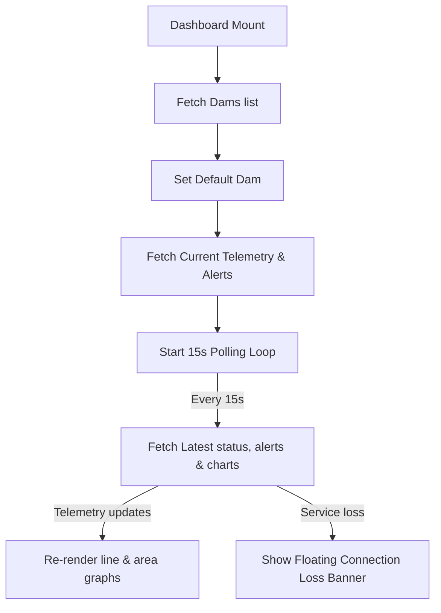

This is a [Next.js](https://nextjs.org) project bootstrapped with [`create-next-app`](https://nextjs.org/docs/app/api-reference/cli/create-next-app).

## Getting Started

First, run the development server:

```bash
npm run dev
# or
yarn dev
# or
pnpm dev
# or
bun dev
```

Open [http://localhost:3000](http://localhost:3000) with your browser to see the result.

You can start editing the page by modifying `app/page.js`. The page auto-updates as you edit the file.

This project uses [`next/font`](https://nextjs.org/docs/app/building-your-application/optimizing/fonts) to automatically optimize and load [Geist](https://vercel.com/font), a new font family for Vercel.

## Learn More

To learn more about Next.js, take a look at the following resources:

- [Next.js Documentation](https://nextjs.org/docs) - learn about Next.js features and API.
- [Learn Next.js](https://nextjs.org/learn) - an interactive Next.js tutorial.

You can check out [the Next.js GitHub repository](https://github.com/vercel/next.js) - your feedback and contributions are welcome!

## Deploy on Vercel

The easiest way to deploy your Next.js app is to use the [Vercel Platform](https://vercel.com/new?utm_medium=default-template&filter=next.js&utm_source=create-next-app&utm_campaign=create-next-app-readme) from the creators of Next.js.

Check out our [Next.js deployment documentation](https://nextjs.org/docs/app/building-your-application/deploying) for more details.

## Frontend System Architecture & Components

The **FloodGuard** SCADA Dashboard is built using React 19, Next.js 16 (App Router), and Recharts for real-time visualization. It operates as a Single-Page Application (SPA) dashboard that polls the server for reservoir telemetry.

### Component Structure & Layout

1. **Dashboard Orchestrator ([page.js](file:///c:/Users/Master/Music/2YP%20my/e22-co2060-floodguard/code/frontend/src/app/page.js))**:
   - The main entry point that manages the state (dams, selected dam, latest status, telemetry, timeframe, and active tab).
   - Contains a **15-second data-polling loop** that synchronizes real-time metrics and alerts from the database.
   - Includes state variables for authentication, checking active engineer sessions (`checkAuth`), and handling alert acknowledgements (`handleAcknowledgeAlert`).

2. **Navigation Tabs**:
   - **Home**: Displays quick stats cards (Max station rainfall, Reservoir status, TTC forecast time) and the main telemetry charts.
   - **Rainfall Details**: Displays rainfall catchment station information, mapping location weights and delays with nested station-specific charts.
   - **History**: Allows historical log querying by category and date range, with built-in front-end date bounds validation.
   - **Control Panel**: Visible to authenticated on-site engineers to acknowledge active flood risk warning alerts.

3. **Supporting Components**:
   - [ThemeProvider.js](file:///c:/Users/Master/Music/2YP%20my/e22-co2060-floodguard/code/frontend/src/components/ThemeProvider.js): Provides the system-wide Dark SCADA design theme.
   - [Navbar.js](file:///c:/Users/Master/Music/2YP%20my/e22-co2060-floodguard/code/frontend/src/components/Navbar.js): Layout navigation header placeholder.
   - **Modular Tab Components** (`src/components/tabs/`):
     - [OverviewTab.js](file:///c:/Users/Master/Music/2YP%20my/e22-co2060-floodguard/code/frontend/src/components/tabs/OverviewTab.js), [LogsTab.js](file:///c:/Users/Master/Music/2YP%20my/e22-co2060-floodguard/code/frontend/src/components/tabs/LogsTab.js), [TrendsPredictionTab.js](file:///c:/Users/Master/Music/2YP%20my/e22-co2060-floodguard/code/frontend/src/components/tabs/TrendsPredictionTab.js), [EarlyWarningTab.js](file:///c:/Users/Master/Music/2YP%20my/e22-co2060-floodguard/code/frontend/src/components/tabs/EarlyWarningTab.js): Refactored and fully lint-compliant tab components intended for future routing modularization.

### Data Fetching & Polling Flow



### Development & Verification Commands

- **Local Development**: `npm run dev`
- **Lint Codebase**: `npm run lint`
- **Compile & Build**: `npm run build`

