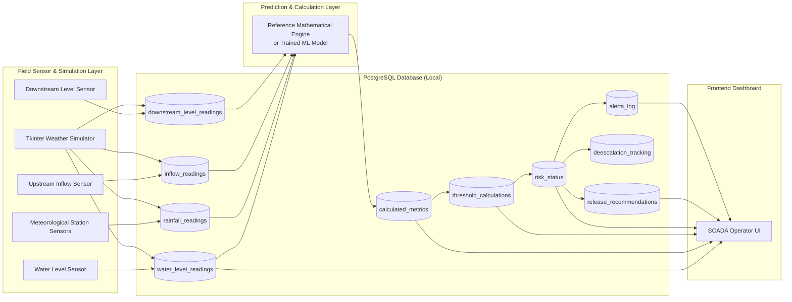

# FloodGuard — Dam Management & Early-Warning System

FloodGuard is an advanced, real-time reservoir monitoring and predictive flood-risk decision-support system. Designed for critical infrastructure management, the platform ingests live sensor telemetry, performs high-resolution divided-difference forecasts, computes dynamic safety thresholds, and provides proportional gate-release recommendations for on-site engineers—warning of hazardous states hours before they manifest.

This repository hosts the canonical **PostgreSQL database schema**, the **core calculation engine algorithms**, the **Next.js integration APIs**, and a **graphical weather simulation suite**.

---

## Table of Contents
- [1. Project Overview](#1-project-overview)
- [2. System Architecture](#2-system-architecture)
- [3. PostgreSQL Database System Schema (3NF)](#3-postgresql-database-system-schema-3nf)
- [4. Calculation Reference & Predictive Algorithm](#4-calculation-reference--predictive-algorithm)
- [5. Machine Learning Integration Contract](#5-machine-learning-integration-contract)
- [6. Simulation & Testing Scenarios](#6-simulation--testing-scenarios)
- [7. Getting Started](#7-getting-started)
- [8. Links](#8-links)

---

## Team

- e22373, L. Sharmilan, e22373@eng.pdn.ac.lk
- e22382, F. R. Sujeevan, e22382@eng.pdn.ac.lk
- e22193, S. Kishonithan, e22193@eng.pdn.ac.lk
- e22397, R. Thilakshan, e22397@eng.pdn.ac.lk

---

## Table of Contents

1. [Project Overview](#1-project-overview)
2. [System Architecture](#2-system-architecture)
3. [PostgreSQL Database System Schema (3NF)](#3-postgresql-database-system-schema-3nf)
4. [Calculation Reference & Predictive Algorithm](#4-calculation-reference--predictive-algorithm)
5. [Machine Learning Integration Contract](#5-machine-learning-integration-contract)
6. [Simulation & Testing Scenarios](#6-simulation--testing-scenarios)
7. [Getting Started](#7-getting-started)
8. [Links](#8-links)

---

## 1. Project Overview

Traditional dam safety protocols rely on static water-level thresholds. If a reservoir level crosses a fixed limit (e.g., 85%), gates are opened. However, under extreme storm conditions, the time required for physical gate configuration and downstream channel evacuation can exceed the safe response window. 

FloodGuard implements a **predictive, adaptive-threshold model** where risk is assessed dynamically based on:
- **Rise Rate & Acceleration:** How fast the reservoir level is rising and whether that rate is accelerating.
- **Weighted Rainfalls:** Lagged, weighted precipitation rates measured across multiple meteorological stations in the catchment area.
- **Upstream Inflow:** Real-time inflow discharge rates feeding the reservoir.
- **Downstream Channel Capacity:** The capacity and water level of downstream channels to avoid flooding surrounding valleys.

Rather than waiting for a breach, the system extrapolates historical trends forward, identifies if and when the predicted water level will cross the predicted safety threshold (the **Time-To-Crossing** or **TTC**), and triggers alarms in advance.

---

## 2. System Architecture



The system operates on an event-driven and polling pipeline:
1. **Sensor Ingestion:** Telemetry is written to the database.
2. **Processor Loop:** Evaluates new raw telemetry, computes metrics and thresholds, checks predictive crossing models, and determines risk states.
3. **Frontend Refresh:** Next.js API layer serves data, refreshing the SCADA panel dynamically on a 15-second polling interval.

---

## 3. PostgreSQL Database System Schema (3NF)

The database schema is fully normalized to Third Normal Form (3NF) to support transactional integrity and clean time-series storage.

### 3.1 Static Configuration Tables

#### `dams`
Holds physical limits, capacities, and baseline calibration thresholds for each dam.
- `dam_id` (SERIAL, PRIMARY KEY): Unique identifier.
- `dam_name` (VARCHAR): Name of the dam.
- `location` (VARCHAR): GPS location name.
- `latitude` / `longitude` (DOUBLE PRECISION): GPS coordinates.
- `elevation_m` (DOUBLE PRECISION): Dam elevation above sea level.
- `reservoir_capacity` (DOUBLE PRECISION): Maximum reservoir volume ($m^3$).
- `downstream_capacity` (DOUBLE PRECISION): Maximum safe downstream outflow capacity ($m^3/s$).
- `max_gate_capacity` (DOUBLE PRECISION): Combined gate discharge capacity ($m^3/s$).
- `if_baseline` (DOUBLE PRECISION): Normal baseline inflow rate ($m^3/s$).
- `base_threshold` (DOUBLE PRECISION, DEFAULT 75.0): Baseline safe operating percentage limit ($L_{base}$).
- `threshold_floor` (DOUBLE PRECISION, DEFAULT 30.0): Absolute floor clamp for adjustments ($L_{floor}$).

#### `engineers`
System user profiles for dam operator logs and alert acknowledgements.
- `engineer_id` (SERIAL, PRIMARY KEY): Unique identifier.
- `name` (VARCHAR): Operator username.
- `role` (VARCHAR): Job role.
- `contact` (VARCHAR): Contact info.
- `assigned_dam_id` (INT, REFERENCES dams): Currently assigned dam.
- `password_hash` (VARCHAR): Bcrypt hash for login credentials.

#### `rainfall_locations`
Catchment meteorological stations associated with the dam.
- `location_id` (SERIAL, PRIMARY KEY): Unique identifier.
- `location_name` (VARCHAR): Station name.
- `latitude` / `longitude` (DOUBLE PRECISION): GPS coordinates.
- `weight` (DOUBLE PRECISION): Calibration coefficient of this station ($w_i$, $\sum w_i = 1.0$).
- `delay_minutes` (DOUBLE PRECISION): Physical lag time for rainfall runoff to reach reservoir ($\tau_i$).
- `station_code` (VARCHAR, UNIQUE): Station sensor identifier.
- `is_active` (BOOLEAN): Status of station connection.

---

### 3.2 Live Time-Series Sensor Tables (3NF)

#### `water_level_readings`
- `reading_id` (BIGSERIAL, PRIMARY KEY)
- `dam_id` (INT, REFERENCES dams)
- `reading_time` (TIMESTAMPTZ): Telemetry timestamp ($t$).
- `water_level_pct` (DOUBLE PRECISION): Current water level percentage ($L(t)$).
- *Constraint:* UNIQUE (`dam_id`, `reading_time`)

#### `inflow_readings`
- `reading_id` (BIGSERIAL, PRIMARY KEY)
- `dam_id` (INT, REFERENCES dams)
- `reading_time` (TIMESTAMPTZ): Inflow measurement time.
- `inflow_rate_m3s` (DOUBLE PRECISION): Upstream discharge rate ($IF(t)$, $m^3/s$).
- *Constraint:* UNIQUE (`dam_id`, `reading_time`)

#### `downstream_level_readings`
- `reading_id` (BIGSERIAL, PRIMARY KEY)
- `dam_id` (INT, REFERENCES dams)
- `reading_time` (TIMESTAMPTZ): Downstream channel level measurement time.
- `downstream_level_pct` (DOUBLE PRECISION): Downstream channel level ($DL(t)$, %).
- *Constraint:* UNIQUE (`dam_id`, `reading_time`)

#### `rainfall_readings`
- `reading_id` (BIGSERIAL, PRIMARY KEY)
- `location_id` (INT, REFERENCES rainfall_locations)
- `reading_time` (TIMESTAMPTZ): Precipitation measurement time.
- `rainfall_mm_hr` (DOUBLE PRECISION): Rainfall rate ($R_i(t)$, $mm/h$).
- *Constraint:* UNIQUE (`location_id`, `reading_time`)

---

### 3.3 Backend Prediction & Calculation Tables

#### `prediction_runs`
Records metadata for each divided-difference forecast run.
- `run_id` (BIGSERIAL, PRIMARY KEY)
- `dam_id` (INT, REFERENCES dams)
- `run_time` (TIMESTAMPTZ): Timestamp when prediction ran.
- `input_window_start` / `input_window_end` (TIMESTAMPTZ): Bounds of data window.
- `method` (VARCHAR): Prediction model type (e.g. `"newton_divided_difference"`).
- `status` (VARCHAR): Result status (`success` / `insufficient_data` / `error`).

#### `predicted_values`
Contains extrapolated future states across forecast horizons ($t+15$ to $t+120$ mins).
- `value_id` (BIGSERIAL, PRIMARY KEY)
- `run_id` (BIGINT, REFERENCES prediction_runs)
- `horizon_minutes` (INT): Forecast horizon in minutes ($h$, e.g., 15, 30, 45, 60, 90, 120).
- `predicted_water_level_pct` (DOUBLE PRECISION): Extrapolated reservoir level ($L_{pred}(t+h)$).
- `predicted_r_net` (DOUBLE PRECISION): Projected net rainfall runoff ($R_{net\_pred}(t+h)$).
- `predicted_inflow` (DOUBLE PRECISION): Extrapolated river inflow ($IF_{pred}(t+h)$).
- `predicted_downstream_level` (DOUBLE PRECISION): Extrapolated downstream level ($DL_{pred}(t+h)$).
- `predicted_rise_rate` (DOUBLE PRECISION): Projected rise rate ($RR_{pred}(t+h)$).
- `predicted_acc` (DOUBLE PRECISION): Projected acceleration ($ACC_{pred}(t+h)$).
- `predicted_adaptive_threshold` (DOUBLE PRECISION): Calculated threshold ($AT_{pred}(t+h)$).
- `gap` (DOUBLE PRECISION): Difference margin ($AT_{pred}(t+h) - L_{pred}(t+h)$).

#### `graph_crossing_results`
Stores summary predictions on threshold crossings.
- `result_id` (BIGSERIAL, PRIMARY KEY)
- `run_id` (BIGINT, REFERENCES prediction_runs)
- `crossing_time_minutes` (INT): Estimated Time-To-Crossing (TTC, minutes). Null if no crossing is predicted.
- `minimum_gap` (DOUBLE PRECISION): Minimum gap predicted across horizons.
- `gap_trend` (VARCHAR): Direction of the gap (`increasing` / `decreasing` / `stable`).
- `final_status` (risk_status_type): Predicted risk status.

#### `calculated_metrics`
Intermediate calculations performed per sensor scan.
- `metric_id` (BIGSERIAL, PRIMARY KEY)
- `dam_id` (INT, REFERENCES dams)
- `calc_time` (TIMESTAMPTZ)
- `rr_short` (DOUBLE PRECISION): Short-term Rise Rate (%/h, 15-min window).
- `rr_long` (DOUBLE PRECISION): Long-term Rise Rate (%/h, 60-min window).
- `acc` (DOUBLE PRECISION): Water level rise acceleration ($ACC(t)$).
- `rolling_avg` (DOUBLE PRECISION): 3-hour rolling average of rise rates ($RA(t)$).
- `deviation_score` (DOUBLE PRECISION): Short-term rise deviation ($DEV(t)$).
- `rr_band` (rr_band_type): Evaluated rise rate band (`NORMAL` / `ELEVATED` / `HIGH` / `CRITICAL`).

#### `threshold_calculations`
- `calc_id` (BIGSERIAL, PRIMARY KEY)
- `dam_id` (INT, REFERENCES dams)
- `calc_time` (TIMESTAMPTZ)
- `rr_adj` / `rf_adj` / `if_adj` / `dl_adj` (DOUBLE PRECISION): Factors pulling threshold down.
- `adaptive_threshold` (DOUBLE PRECISION): Computed live safety threshold ($AT(t)$).
- `floor_triggered` (BOOLEAN): True if clamped at $L_{floor}$ (30%).
- `ceiling_triggered` (BOOLEAN): True if clamped at $L_{base}$ (75%).

#### `risk_status`
Official alert state of the dam.
- `status_id` (BIGSERIAL, PRIMARY KEY)
- `dam_id` (INT, REFERENCES dams)
- `status_time` (TIMESTAMPTZ)
- `status` (risk_status_type): `GREEN`, `YELLOW`, `ORANGE`, `RED`.
- `ttc_minutes` (INT): Active warning Time-To-Crossing.
- `trigger_reason` (TEXT): Text description of rule triggered.
- `previous_status` (risk_status_type)

#### `release_recommendations`
Proportional gate release plans calculated for ORANGE or RED status.
- `release_id` (BIGSERIAL, PRIMARY KEY)
- `dam_id` (INT, REFERENCES dams)
- `run_id` (BIGINT, REFERENCES prediction_runs)
- `calc_time` (TIMESTAMPTZ)
- `strategy` (VARCHAR): Formula type (`"proportional_rise_rate"`).
- `rise_rate_used` (DOUBLE PRECISION): $RR_{pred}(t+15)$ used for rate estimation.
- `gate_opening_base_pct` (DOUBLE PRECISION): Base gate percentage before downstream capacity overrides.
- `q_desired` (DOUBLE PRECISION): Volumetrically required release ($m^3/s$).
- `q_downstream_available` (DOUBLE PRECISION): Maximum safe downstream capacity window ($m^3/s$).
- `q_release` (DOUBLE PRECISION): Final recommended discharge rate ($m^3/s$).
- `gate_opening_applied_pct` (DOUBLE PRECISION): Final gate opening recommendation, rounded to 5%.
- `conflict_warning` (BOOLEAN): True if desired release exceeds downstream safety limits.
- `estimated_duration_minutes` (DOUBLE PRECISION): Time required to return to safe storage level.

#### `deescalation_tracking`
Maintains cumulative timers for de-escalation dampening.
- `tracking_id` (BIGSERIAL, PRIMARY KEY)
- `dam_id` (INT, REFERENCES dams)
- `condition_met_since` (TIMESTAMPTZ): Start timestamp of sustained improvement.
- `consecutive_minutes` (INT): Tracked elapsed minutes.
- `required_minutes` (INT): Required wait duration for downgrade (15 / 30 / 60 mins).
- `transition_from` / `transition_to` (risk_status_type)
- `eligible_flag` (BOOLEAN)

---

## 4. Calculation Reference & Predictive Algorithm

The reference engine processes mathematical updates on every ingestion cycle (1-minute intervals during real-time telemetry, or 15-second intervals under simulator conditions).

### 4.1 Inflow, Level, & Runoff Inputs

The engine ingests:
- $L(t)$ : Reservoir water level (% of maximum height).
- $IF(t)$ : Upstream river inflow rate ($m^3/s$).
- $DL(t)$ : Downstream river level (% of safe capacity).
- $R_i(t)$ : Local rainfall rate ($mm/h$) at station $i$.

#### Weighted Net Catchment Rainfall ($R_{net}$)
To account for geographic delays, rainfall runoff is modeled by looking back at station delay offsets ($\tau_i$). If a station has missing telemetry, weights are scaled dynamically:

$$R_{net}(t) = \frac{\sum w_i R_i(t - \tau_i)}{\sum w_{active}}$$

---

### 4.2 Rise Rate & Acceleration

#### Short-term Rise Rate ($RR_{short}$)
Measures water level rate of change over the last 15 minutes, scaled to an hourly rate:

$$RR_{short}(t) = [L(t) - L(t - 15)] \times 4 \quad (\%/hour)$$

#### Long-term Rise Rate ($RR_{long}$)
Measures change over the last 60 minutes:

$$RR_{long}(t) = [L(t) - L(t - 60)] \times 1 \quad (\%/hour)$$

#### Rise Rate Acceleration ($ACC$)
Measures the change in long-term rise rate over the preceding hour:

$$ACC(t) = RR_{long}(t) - RR_{long}(t - 60) \quad (\%/hour^2)$$

#### Rolling Average ($RA$) & Deviation Score ($DEV$)
Calculates the 3-hour moving average of the long-term rise rate and compares it to the short-term spike rate to identify flash surge anomalies:

$$RA(t) = \text{Average}(RR_{long}) \text{ over last 3 hours}$$

$$DEV(t) = RR_{short}(t) - RA(t)$$

---

### 4.3 Severity Classifications (Bands)

Telemetry states are classified into four rise-rate severity bands. The worst individual parameter match determines the band.

| Severity Band | Long-Term Rise Rate | Short-Term Rise Rate | Acceleration |
|---|---|---|---|
| **NORMAL** | $< 1.0\,\%/h$ | AND $< 2.0\,\%/h$ | AND $\le 0.5\,\%/h^2$ |
| **ELEVATED** | $1.0\text{--}2.5\,\%/h$ | OR $2.0\text{--}4.0\,\%/h$ | OR $0.5\text{--}1.5\,\%/h^2$ |
| **HIGH** | $2.5\text{--}4.0\,\%/h$ | OR $4.0\text{--}7.0\,\%/h$ | OR $1.5\text{--}3.0\,\%/h^2$ |
| **CRITICAL** | $> 4.0\,\%/h$ | OR $> 7.0\,\%/h$ | OR $> 3.0\,\%/h^2$ (or $DEV > 5.0$) |

---

### 4.4 Adaptive Safety Threshold ($AT$)

The safety threshold shifts downwards from `BASE` (75%) depending on hydrological stresses, clamped at a minimum `FLOOR` (30%).

$$AT(t) = \text{Clamp}( L_{base} - rr_{adj} - rf_{adj} - if_{adj} - dl_{adj},\; L_{floor},\; L_{base} )$$

#### Individual Penalties

1. **Rise Rate Adjustment ($rr_{adj}$):**
   - `NORMAL`: 0% | `ELEVATED`: 8% | `HIGH`: 18% | `CRITICAL`: 30%
2. **Rainfall Adjustment ($rf_{adj}$):**
   - $R_{net} < 10$: 0% | $10\text{--}25$: 3% | $25\text{--}50$: 7% | $> 50\,\text{mm/h}$: 12%
3. **Inflow Adjustment ($if_{adj}$):** (relative to baseline inflow $IF_{base}$)
   - $IF(t) < 1.5 \times IF_{base}$: 0% | $1.5\text{--}2.5 \times$: 4% | $2.5\text{--}4 \times$: 8% | $> 4 \times IF_{base}$: 13%
4. **Downstream level Adjustment ($dl_{adj}$):**
   - $DL < 50\%$: 0% | $50\text{--}70\%$: 3% | $70\text{--}85\%$: 8% | $> 85\%$: 15%

---

### 4.5 Newton Divided-Difference Extrapolation

For prediction cycles, the engine fits a polynomial through recent historical readings to extrapolate water levels ($L_{pred}(t+h)$) and inflow rates ($IF_{pred}(t+h)$) for horizons $h \in \{15, 30, 45, 60, 90, 120\}$ minutes.

To avoid high-degree oscillations (Runge's phenomenon), the engine selects a low-degree fit (linear or quadratic) using the last 3-4 historical data points spaced over a rolling 6-hour window.

#### Divided-Difference Table
Given nodes $(x_0, y_0), (x_1, y_1), \dots, (x_k, y_k)$, divided differences are defined recursively:

$$f[x_i] = y_i$$

$$f[x_i, x_{i+1}, \dots, x_{i+j}] = \frac{f[x_{i+1}, \dots, x_{i+j}] - f[x_i, \dots, x_{i+j-1}]}{x_{i+j} - x_i}$$

The interpolating polynomial is:

$$P(x) = f[x_0] + \sum_{i=1}^k f[x_0, \dots, x_i] \prod_{j=0}^{i-1} (x - x_j)$$

---

### 4.6 Graph Crossing Analysis & Time-To-Crossing ($TTC$)

A crossing is predicted if the gap margin at any horizon $h$ falls to or below zero:

$$Gap(t+h) = AT_{pred}(t+h) - L_{pred}(t+h) \le 0$$

- **$TTC$ (Time-To-Crossing):** The smallest horizon $h$ where $Gap(t+h) \le 0$.
- **Gap Trend:** Evaluated as `increasing`, `decreasing`, or `stable` by analyzing the derivative differentials of the margins:

$$\Delta Gap = Gap(t+h) - Gap(t+h-15)$$

---

### 4.7 Risk Status Classification Rules

Risk statuses are evaluated in order of severity. First match wins.

| Risk Status | Trigger Conditions |
|---|---|
| 🔴 **Red** | $L(t) \ge AT(t)$ (Current level exceeds safety threshold)<br/>OR $TTC \le 15$ minutes (Crossing imminent)<br/>OR $RR_{band} = \text{CRITICAL}$ |
| 🟠 **Orange** | $L(t) \ge AT(t) + 3\%$ (Within 3% of threshold)<br/>OR ($TTC \le 60$ minutes)<br/>OR ($RR_{band} = \text{HIGH}$ AND Gap Trend = `decreasing`) |
| 🟡 **Yellow** | $L(t) \ge AT(t) + 10\%$ (Within 10% of threshold)<br/>OR ($TTC > 60$ minutes)<br/>OR ($RR_{band} = \text{ELEVATED}$)<br/>OR ($TTC = \text{Null}$ AND Gap Trend = `decreasing`) |
| 🟢 **Green** | All other conditions |

---

### 4.8 Proportional Release Recommendations

Calculated when risk status reaches ORANGE or RED.

1. **Calculate Volumetrically Desired Discharge ($Q_{desired}$):**
   Calculates the release rate required to bring the reservoir down to the threshold level over the next hour:
   
   $$Q_{desired}(t) = IF(t) - \frac{(AT(t) - L(t)) \times \text{Capacity}_{reservoir}}{3600 \times 100} \quad (m^3/s)$$

2. **Downstream Safety Limit ($Q_{down\_avail}$):**
   Calculates the remaining capacity of the downstream channel:
   
   $$Q_{down\_avail}(t) = \text{Capacity}_{downstream} \times \left(1 - \frac{DL(t)}{100}\right) \quad (m^3/s)$$

3. **Apply Safety Overrides:**
   
   $$Q_{release}(t) = \text{Min}\left(Q_{desired}(t),\; Q_{down\_avail}(t),\; \text{Capacity}_{max\_gate}\right)$$
   
   If $Q_{desired} > Q_{down\_avail}$, a `CONFLICT WARNING` is flagged to inform operators that the downstream channel is constrained.

4. **Proportional Gate Opening:**
   
   $$\text{GateOpening}\% = \left(\frac{Q_{release}(t)}{\text{Capacity}_{max\_gate}}\right) \times 100$$
   
   Rounded to the nearest 5% for operator configuration.

5. **Estimated Discharge Duration ($t_{duration}$):**
   Calculates the duration (minutes) needed to lower the level to a target buffer level ($AT(t) - 10\%$):
   
   $$t_{duration} = \frac{L(t) - (AT(t) - 10.0)}{\left(\frac{Q_{release} - IF(t)}{\text{Capacity}_{reservoir}}\right) \times 100 \times 60} \quad \text{minutes}$$

---

### 4.9 Sustained De-escalation Timers

Status downgrades are delayed to prevent rapid toggling due to noise. The system must meet de-escalation rules continuously:

- **RED $\rightarrow$ ORANGE (15 Mins):** $RR_{band} \in \{\text{NORMAL}, \text{ELEVATED}\}$ AND $ACC \le 0.0$ AND $L(t)$ stable or dropping.
- **ORANGE $\rightarrow$ YELLOW (30 Mins):** $RR_{band} \in \{\text{NORMAL}, \text{ELEVATED}\}$ AND $ACC \le 0.0$ AND ($R_{net}$ decreasing OR $R_{net} < 0.001\,\text{mm/h}$).
- **YELLOW $\rightarrow$ GREEN (60 Mins):** $RR_{band} = \text{NORMAL}$ AND $L(t)$ stable or dropping.

---

## 5. Machine Learning Integration Contract

The prediction layer is model-agnostic. The deterministic reference algorithm can be swapped for a trained ML model by satisfying this integration contract.

```
+------------------+       Reads telemetry       +------------------+
|   PostgreSQL     | --------------------------> |  Trained Model   |
|   Database       | <-------------------------- |  (Python Script) |
+------------------+    Writes predictions &     +------------------+
                            risk status
```

### 5.1 Inputs
The model must query live and historical time-series data directly from:
- `water_level_readings`
- `rainfall_readings` (resolving weights and delays from `rainfall_locations`)
- `inflow_readings`
- `downstream_level_readings`

### 5.2 Outputs
The model must write its calculated predictions into the database tables:
1. **`calculated_metrics`:** Populate rise rates, acceleration, rolling average, deviation, and rise rate band.
2. **`threshold_calculations`:** Populate the calculated dynamic safety threshold and adjustments.
3. **`risk_status`:** Set the calculated risk status.
4. **`release_recommendations`:** Generate proportional gate openings and safe release rates.

---

## 6. Simulation & Testing Scenarios

The Tkinter weather simulator generates real-time telemetry to test system responses.

- **Drought / Dry Season:** Net rainfall is $0.0\,mm/h$, inflows decline ($80 \rightarrow 20\,m^3/s$), water level drops. Status remains `GREEN`.
- **South-West Monsoon:** Moderate rain ($5\text{--}16\,mm/h$), inflow increases ($120 \rightarrow 450\,m^3/s$), level rises. Status triggers `YELLOW` and `ORANGE`.
- **North-East Monsoon Storm:** Spikes rain ($70\,mm/h$), inflow rises ($1800\,m^3/s$). Level exceeds threshold, status triggers `RED` and release recommendations activate.
- **Inter-Monsoon Thunderstorm:** Short convective rain burst ($90\,mm/h$), rapid rise rate triggers an immediate `RED` status.
- **Tropical Cyclone Surge:** Torrential rain ($50\,mm/h$), high downstream level ($DL > 85\%$). Triggers `RED` with active downstream constraints and conflict warnings.

---

## 7. Getting Started

### 7.1 Database Initialization
Create your local PostgreSQL database and load the schema:

```bash
# Create local database
createdb dam_management

# Apply schema migrations
psql -U postgres -d dam_management -f ./code/database/dam_management_schema.sql
```

### 7.2 Service Execution
1. Copy `.env.example` to `.env` and fill in your PostgreSQL credentials:
   ```bash
   cp .env.example .env
   ```
2. Install Python dependencies:
   ```bash
   pip install -r requirements.txt
   ```
3. Launch backend services (launches the Tkinter GUI and calculation loops):
   ```bash
   python code/main.py
   ```
4. Start the frontend Next.js server:
   ```bash
   cd code/frontend
   npm install
   npm run dev
   ```
   Open `http://localhost:3000` to view the SCADA control panel.

---

## 8. Links

- **Repository:** <https://github.com/cepdnaclk/e22-co2060-floodguard>
- **Project Site:** <https://cepdnaclk.github.io/e22-co2060-floodguard>
- **Department of Computer Engineering:** <http://www.ce.pdn.ac.lk/>
- **University of Peradeniya:** <https://eng.pdn.ac.lk/>
