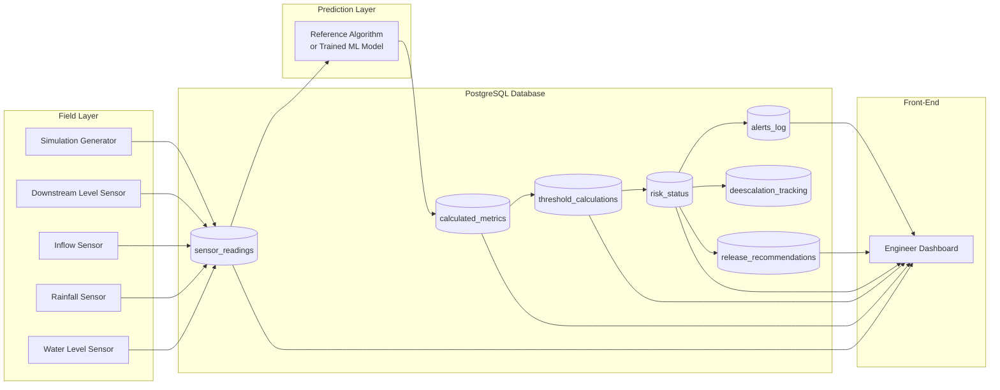
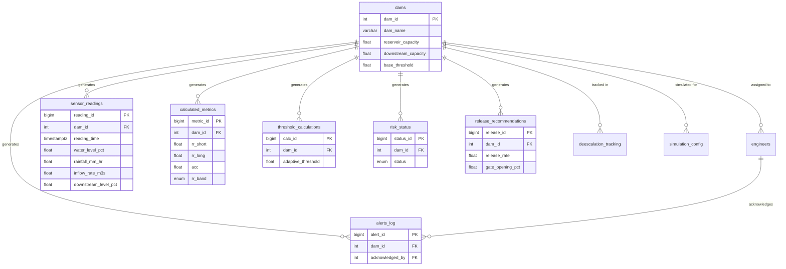

# FloodGuard — Dam Management & Early-Warning System

An open-source platform for real-time dam monitoring and predictive flood-risk management. The system ingests live sensor and weather data, calculates a set of hydrological risk indicators, determines a dam's current risk status, and recommends safe water-release actions to on-site engineers — before conditions become dangerous.

This repository provides the **database schema**, the **calculation logic specification**, and the **integration contract** required to plug in your own machine learning model in place of the reference algorithm.

---

## Team

- e22373, L. Sharmilan, e22373@eng.pdn.ac.lk
- e22382, F. R. Sujeevan, e22382@eng.pdn.ac.lk
- e22193, S. Kishonithan, e22193@eng.pdn.ac.lk
- e22397, R. Thilakshan, e22397@eng.pdn.ac.lk

---

## Table of Contents

1. [Project Overview](#1-project-overview)
2. [System Architecture](#2-system-architecture)
3. [Data Pipeline](#3-data-pipeline)
4. [Database Schema](#4-database-schema)
5. [Table Relationships (ERD)](#5-table-relationships-erd)
6. [Calculation Reference — Formulas](#6-calculation-reference--formulas)
7. [Risk Status & Alerting Logic](#7-risk-status--alerting-logic)
8. [Release Recommendation Logic](#8-release-recommendation-logic)
9. [De-escalation Logic](#9-de-escalation-logic)
10. [Machine Learning Integration Contract](#10-machine-learning-integration-contract)
11. [Simulation & Testing](#11-simulation--testing)
12. [Getting Started](#12-getting-started)
13. [Contributing](#13-contributing)
14. [License](#14-license)
15. [Links](#15-links)

---

## 1. Project Overview

Dams present a unique monitoring challenge: by the time a water level crosses a fixed danger threshold, the window to respond safely has often already closed. This project treats **risk as adaptive rather than fixed** — the danger threshold for a dam moves dynamically based on how fast the water is rising, how hard it's raining upstream, how much water is flowing in, and how full the downstream channel already is.

The system is built around three cooperating components:

| Component | Responsibility |
|---|---|
| **Sensor / Simulation Layer** | Supplies live (or simulated) water level, rainfall, inflow, and downstream level readings every minute |
| **Prediction Layer** | Consumes live data and produces calculated risk metrics, an adaptive threshold, a risk status, and release recommendations. This layer is **model-agnostic** — it currently runs a deterministic reference algorithm, and is designed to be replaced by a trained machine learning model without changing the database or front-end |
| **Database & Front-End Layer** | Persists every stage of the pipeline with timestamps and presents live status, history, and recommendations to dam engineers |

Because the prediction layer's inputs and outputs are fixed by a documented contract (see [Section 10](#10-machine-learning-integration-contract)), **any team can swap in their own ML model** — trained on this repository's schema — without needing to modify a single table or front-end component. This is the core reason the project is open-sourced: the schema and reference algorithm are the shared foundation that any model, from any team, can build against.

---

## 2. System Architecture



**Design principle:** the prediction layer reads from `sensor_readings` and writes to `calculated_metrics`, `threshold_calculations`, `risk_status`, and `release_recommendations`. Nothing upstream or downstream of that layer needs to know whether the numbers came from the reference algorithm or a trained model — this is the "unplug the script, plug in the model" boundary.

---

## 3. Data Pipeline

The system operates on two clocks:

**Every 1 minute:**
1. Receive `L(t)`, `RF(t)`, `IF(t)`, `DL(t)` from sensors (or simulator)
2. Calculate `RR_short`, `RR_long`, `ACC`, `RA`, `DEV`
3. Determine `RR_band` (Normal / Elevated / High / Critical)
4. Calculate `RR_adj`, `RF_adj`, `IF_adj`, `DL_adj`
5. Calculate `AT(t)` = adaptive threshold (floor applied at 30%)
6. Determine `STATUS` (Green / Yellow / Orange / Red)
7. If Orange or Red → calculate a release recommendation
8. Store all values with a timestamp
9. Update the dashboard
10. Fire an alert if status has worsened since the last check

**Every 15 minutes:**
11. Run the de-escalation check
12. Recalculate the release recommendation if one is currently active

---

## 4. Database Schema

All tables are designed for PostgreSQL. Full `CREATE TABLE` statements are provided in [`dam_management_schema.sql`](./dam_management_schema.sql).

### 4.1 `dams` — Static Configuration

One row per physical dam. Holds the constants every calculation depends on.

| Column | Type | Description |
|---|---|---|
| dam_id (PK) | SERIAL | Unique dam identifier |
| dam_name | VARCHAR | Name of the dam |
| location | VARCHAR | General location/region |
| latitude, longitude | DOUBLE PRECISION | GPS coordinates |
| reservoir_capacity | DOUBLE PRECISION | Total reservoir capacity (m³) |
| downstream_capacity | DOUBLE PRECISION | Downstream channel capacity (m³/s) |
| max_gate_capacity | DOUBLE PRECISION | Maximum gate release capacity |
| if_baseline | DOUBLE PRECISION | Normal baseline inflow rate (m³/s) |
| base_threshold | DOUBLE PRECISION | Default safe operating level, default 75% |
| threshold_floor | DOUBLE PRECISION | Minimum allowed threshold, default 30% |
| created_at, updated_at | TIMESTAMPTZ | Record timestamps |

### 4.2 `engineers` — Front-End Users

| Column | Type | Description |
|---|---|---|
| engineer_id (PK) | SERIAL | Unique engineer identifier |
| name | VARCHAR | Full name |
| role | VARCHAR | Job title |
| contact | VARCHAR | Phone/email |
| assigned_dam_id (FK → dams) | INT | Dam this engineer monitors |
| created_at | TIMESTAMPTZ | Record timestamp |

### 4.3 `sensor_readings` — Raw Input Data

Written every minute, by real sensors in production or by the simulation generator during testing.

| Column | Type | Description |
|---|---|---|
| reading_id (PK) | BIGSERIAL | Unique reading identifier |
| dam_id (FK → dams) | INT | Dam this reading belongs to |
| reading_time | TIMESTAMPTZ | Timestamp `t` |
| water_level_pct | DOUBLE PRECISION | `L(t)` — reservoir water level (%) |
| rainfall_mm_hr | DOUBLE PRECISION | `RF(t)` — upstream rainfall intensity (mm/hour) |
| inflow_rate_m3s | DOUBLE PRECISION | `IF(t)` — upstream river inflow rate (m³/s) |
| downstream_level_pct | DOUBLE PRECISION | `DL(t)` — downstream river level (% of safe capacity) |

### 4.4 `calculated_metrics` — Rise Rate & Deviation

Output of the prediction layer's first stage.

| Column | Type | Description |
|---|---|---|
| metric_id (PK) | BIGSERIAL | Unique record identifier |
| dam_id (FK → dams) | INT | Dam this metric belongs to |
| calc_time | TIMESTAMPTZ | Timestamp of calculation |
| rr_short | DOUBLE PRECISION | Short-term rise rate (% per hour, 15-min window) |
| rr_long | DOUBLE PRECISION | Long-term rise rate (% per hour, 60-min window) |
| acc | DOUBLE PRECISION | Acceleration of rise rate |
| rolling_avg | DOUBLE PRECISION | 3-hour rolling average of `RR_long` |
| deviation_score | DOUBLE PRECISION | Deviation of current behaviour from recent average |
| rr_band | ENUM | Normal / Elevated / High / Critical |

### 4.5 `threshold_calculations` — Adaptive Threshold

| Column | Type | Description |
|---|---|---|
| calc_id (PK) | BIGSERIAL | Unique record identifier |
| dam_id (FK → dams) | INT | Dam this calculation belongs to |
| calc_time | TIMESTAMPTZ | Timestamp of calculation |
| rr_adj, rf_adj, if_adj, dl_adj | DOUBLE PRECISION | Individual factor adjustments (%) |
| adaptive_threshold | DOUBLE PRECISION | `AT(t)` — final adaptive threshold (%) |
| floor_triggered | BOOLEAN | True if the 30% floor rule was applied |
| ceiling_triggered | BOOLEAN | True if threshold was capped at BASE (75%) |

### 4.6 `risk_status` — Current Risk Zone

| Column | Type | Description |
|---|---|---|
| status_id (PK) | BIGSERIAL | Unique record identifier |
| dam_id (FK → dams) | INT | Dam this status belongs to |
| status_time | TIMESTAMPTZ | Timestamp of status evaluation |
| status | ENUM | Green / Yellow / Orange / Red |
| margin_1, margin_2, margin_3 | DOUBLE PRECISION | Warning margins above the adaptive threshold |
| trigger_reason | TEXT | Condition that caused this status |
| previous_status | ENUM | Prior status, used to detect status changes |

### 4.7 `release_recommendations` — Gate Release Plan

Populated only when `risk_status` is Orange or Red.

| Column | Type | Description |
|---|---|---|
| release_id (PK) | BIGSERIAL | Unique record identifier |
| dam_id (FK → dams) | INT | Dam this recommendation belongs to |
| calc_time | TIMESTAMPTZ | Timestamp of calculation |
| release_rate | DOUBLE PRECISION | Required release rate (m³/s) |
| safe_storage_rate | DOUBLE PRECISION | Rate the reservoir can safely absorb |
| max_safe_release | DOUBLE PRECISION | Maximum release the downstream channel can accept |
| conflict_warning | BOOLEAN | True if required release exceeds downstream capacity |
| gate_opening_pct | DOUBLE PRECISION | Recommended gate opening, rounded to nearest 5% |
| estimated_duration_min | DOUBLE PRECISION | Estimated time to reach a safe level |
| target_safe_level | DOUBLE PRECISION | Target water level: `AT(t) − 10%` |

### 4.8 `deescalation_tracking` — Sustained Improvement Tracking

De-escalation requires *sustained* improvement, not a single good reading — this table tracks that state over time.

| Column | Type | Description |
|---|---|---|
| tracking_id (PK) | BIGSERIAL | Unique record identifier |
| dam_id (FK → dams) | INT | Dam being tracked |
| condition_met_since | TIMESTAMPTZ | When the improving condition first appeared |
| consecutive_minutes | INT | Minutes the condition has held continuously |
| required_minutes | INT | Minutes required for this transition (15 / 30 / 60) |
| transition_from, transition_to | ENUM | The status transition being evaluated |
| eligible_flag | BOOLEAN | Whether de-escalation can now occur |

### 4.9 `alerts_log` — Alert History

| Column | Type | Description |
|---|---|---|
| alert_id (PK) | BIGSERIAL | Unique alert identifier |
| dam_id (FK → dams) | INT | Dam this alert concerns |
| alert_time | TIMESTAMPTZ | Time the alert was fired |
| previous_status, new_status | ENUM | Status change that triggered the alert |
| message | TEXT | Human-readable alert description |
| acknowledged_by (FK → engineers) | INT | Engineer who acknowledged the alert |
| acknowledged_at | TIMESTAMPTZ | Acknowledgement timestamp |

### 4.10 `simulation_config` — Test Data Generator Settings

| Column | Type | Description |
|---|---|---|
| config_id (PK) | SERIAL | Unique configuration identifier |
| dam_id (FK → dams) | INT | Dam this scenario simulates |
| scenario_name | VARCHAR | Name of the simulated scenario (e.g. "Heavy Monsoon Spike") |
| start_time, end_time | TIMESTAMPTZ | Simulation time window |
| description | TEXT | Notes on scenario purpose |

---

## 5. Table Relationships (ERD)



`dam_id` is the anchor of the entire schema — every time-series table carries it directly (rather than only through joins) so the front-end can query "give me the latest full picture for Dam X" without needing multi-hop joins.

---

## 6. Calculation Reference — Formulas

This section documents every formula in the reference algorithm, in the order they are computed each minute.

### 6.1 Inputs (collected every 1 minute)

| Symbol | Meaning | Unit |
|---|---|---|
| `L(t)` | Current reservoir water level | % |
| `RF(t)` | Upstream rainfall intensity | mm/hour |
| `IF(t)` | Upstream river inflow rate | m³/second |
| `DL(t)` | Downstream river level, % of normal safe capacity | % |
| `t` | Current timestamp | — |

### 6.2 Rise Rate

**Short-term (last 15 minutes):**

```
RR_short(t) = (L(t) − L(t−15)) × 4
```

Multiplying by 4 converts a 15-minute change into a "% per hour" figure (15 × 4 = 60 minutes), so both rise rates share the same unit.

**Long-term (last 60 minutes):**

```
RR_long(t) = L(t) − L(t−60)
```

Already expressed in % per hour — no conversion needed.

`RR_short` catches sudden spikes; `RR_long` catches sustained dangerous trends. Both are monitored simultaneously.

**Worked example:** `L(t)=48.0%`, `L(t−15)=46.5%`, `L(t−60)=44.0%`  
`RR_short = (48.0 − 46.5) × 4 = 6.0%/hour` (spike detected)  
`RR_long = 48.0 − 44.0 = 4.0%/hour` (sustained rise)

### 6.3 Acceleration

```
ACC(t) = RR_long(t) − RR_long(t−60)
```

Current 1-hour rise rate minus the rise rate from one hour ago.

| Result | Meaning |
|---|---|
| `ACC > 0` | Rise rate is accelerating (getting worse) |
| `ACC = 0` | Rise rate is stable |
| `ACC < 0` | Rise rate is decelerating (improving) |

**Worked example:** `RR_long now = 4.0`, `RR_long 1hr ago = 2.0` → `ACC = +2.0` → accelerating, situation worsening.

### 6.4 Rolling Average & Deviation Score

**Rolling average (last 3 hours):**

```
RA(t) = average of RR_long over the last 180 readings
      = ( Σ RR_long(t) … RR_long(t−180) ) / 180
```

**Deviation score:**

```
DEV(t) = RR_short(t) − RA(t)
```

| DEV range | Interpretation |
|---|---|
| `< 1.0` | Normal — current rise matches recent behaviour |
| `1.0 – 2.5` | Elevated — rising faster than recent average |
| `2.5 – 5.0` | High — significantly abnormal behaviour |
| `> 5.0` | Critical — extreme deviation from normal pattern |

**Worked example:** `RA=1.0`, `RR_short=6.0` → `DEV = 6.0 − 1.0 = 5.0` → critical deviation.

### 6.5 Rise Rate Risk Bands

These bands are the calibration values referenced throughout the rest of the pipeline. **If any single condition in a band is met, that band is triggered.** When multiple bands are triggered simultaneously, the worst one always wins.

| Band | RR_long | RR_short | ACC |
|---|---|---|---|
| **Normal** | < 1.0%/hr | AND < 2.0%/hr | AND ≤ 0.5 |
| **Elevated** | 1.0 – 2.5%/hr | OR 2.0 – 4.0%/hr | OR 0.5 – 1.5 |
| **High** | 2.5 – 4.0%/hr | OR 4.0 – 7.0%/hr | OR 1.5 – 3.0 |
| **Critical** | > 4.0%/hr | OR > 7.0%/hr | OR > 3.0 (or `DEV > 5.0`) |

### 6.6 Individual Factor Adjustments

Each of the four live inputs pulls the safe threshold downward as conditions worsen.

**Rise Rate Adjustment** (based on the band from 6.5):

| Band | RR_adj |
|---|---|
| Normal | 0% |
| Elevated | 8% |
| High | 18% |
| Critical | 30% |

**Upstream Rainfall Adjustment:**

| RF(t) | RF_adj | Description |
|---|---|---|
| < 10 mm/hr | 0% | Light rain |
| 10 – 25 mm/hr | 3% | Moderate rain |
| 25 – 50 mm/hr | 7% | Heavy rain |
| > 50 mm/hr | 12% | Extreme rain |

**Upstream Inflow Adjustment** (relative to each dam's `IF_baseline`):

| IF(t) | IF_adj |
|---|---|
| < 1.5 × baseline | 0% |
| 1.5 – 2.5 × baseline | 4% |
| 2.5 – 4 × baseline | 8% |
| > 4 × baseline | 13% |

**Downstream Level Adjustment:**

| DL(t) | DL_adj | Description |
|---|---|---|
| < 50% | 0% | Downstream safe |
| 50 – 70% | 3% | Downstream filling |
| 70 – 85% | 8% | Downstream high |
| > 85% | 15% | Downstream critical |

### 6.7 Final Adaptive Threshold

```
AT(t) = BASE − RR_adj − RF_adj − IF_adj − DL_adj
```

Where `BASE = 75%` (default safe operating level, configurable per dam).

**Floor rule:** `AT(t)` must never go below 30% — this prevents the system from demanding a gate opening at unreasonably low levels.

```
IF AT(t) < 30% THEN AT(t) = 30%
```

**Ceiling rule:** `AT(t)` must never exceed `BASE` — the threshold never moves *up* beyond the baseline safe level.

**Worked example:**

```
BASE = 75%, RR_adj = 18% (High band), RF_adj = 7% (heavy rain),
IF_adj = 8% (2.5× normal inflow), DL_adj = 3% (downstream 60%)

AT(t) = 75 − 18 − 7 − 8 − 3 = 39%
```

Meaning: under today's conditions, action is required once the reservoir hits 39% — not the default 75% — because rainfall, inflow, and downstream conditions have all made a lower level dangerous.

---

## 7. Risk Status & Alerting Logic

Given the current level `L(t)` and adaptive threshold `AT(t)`, three warning margins are defined above the threshold:

```
MARGIN_1 = AT(t) + 20%   (first warning zone starts here)
MARGIN_2 = AT(t) + 10%   (second warning zone)
MARGIN_3 = AT(t) + 3%    (near threshold)
THRESHOLD = AT(t)         (action required)
```

Status rules are evaluated **in order**, and the **first match wins**:

| Status | Condition | Action |
|---|---|---|
| 🔴 **Red** | `L(t) ≥ AT(t)` OR `RR_band = Critical` OR (`DL > 85%` AND `RR_band ≥ High`) | Immediate gate operation required |
| 🟠 **Orange** | `L(t) ≥ MARGIN_3` OR (`RR_band = High` AND `ACC > 0`) | Begin controlled partial release; alert downstream communities |
| 🟡 **Yellow** | `L(t) ≥ MARGIN_2` OR `RR_band = Elevated` | Operators on standby, prepare |
| 🟢 **Green** | All other conditions | Continue monitoring |

An alert is fired to `alerts_log` whenever the status **worsens** compared to the previous check.

---

## 8. Release Recommendation Logic

Calculated only when status reaches Orange or Red, and reassessed every 15 minutes while active.

**Step 1 — Required release rate:**

```
SafeStorageRate = (AT(t) − L(t)) × ReservoirCapacity / 60
ReleaseRate = IF(t) − SafeStorageRate
```

**Step 2 — Downstream constraint:**

```
MaxSafeRelease = DownstreamCapacity × (1 − DL(t)/100)

IF ReleaseRate > MaxSafeRelease:
    ReleaseRate = MaxSafeRelease
    → Trigger CONFLICT WARNING:
      "Full required release exceeds downstream capacity"
```

**Step 3 — Gate opening percentage:**

```
GateOpening% = (ReleaseRate / MaxGateCapacity) × 100
```

Rounded to the nearest 5% for practical operator use.

**Step 4 — Estimated duration:**

```
TargetSafeLevel = AT(t) − 10%   (safety buffer below threshold)

Duration = (L(t) − TargetSafeLevel) / (ReleaseRate − IF(t)) × 60 minutes
```

**Step 5 — Reassessment:** every 15 minutes, all of the above is recalculated and the gate recommendation adjusted as conditions change.

---

## 9. De-escalation Logic

Status must be downgraded when conditions genuinely improve — but a single good reading is not sufficient. **Improvement must be sustained**, which is why `deescalation_tracking` exists as its own stateful table.

| Transition | Condition | Sustained For |
|---|---|---|
| **Red → Orange** | `RR_long` < High-band threshold AND `ACC < 0` AND `L(t)` dropping or stable | 15 consecutive minutes |
| **Orange → Yellow** | `RR_long` in Elevated band AND `ACC ≤ 0` AND `RF(t)` decreasing | 30 consecutive minutes |
| **Yellow → Green** | All inputs back to Normal band AND `L(t)` stable or dropping | 60 consecutive minutes |

This graduated sustain-time (15 → 30 → 60 minutes) prevents the system from flickering rapidly between states as conditions fluctuate near a boundary.

---

## 10. Machine Learning Integration Contract

This project currently uses a **deterministic reference algorithm** (documented in full above) standing in for a trained machine learning model. This is intentional: it lets the database and front-end be built, tested, and demonstrated while a model is developed in parallel — and lets **any team's model be substituted later without touching the schema.**

**To integrate your own model, it must:**

1. **Read** from `sensor_readings` (the same four inputs: `water_level_pct`, `rainfall_mm_hr`, `inflow_rate_m3s`, `downstream_level_pct`, plus historical rows for time-window calculations).
2. **Write** its outputs into the same four tables, using the same column names, on the same cadence (every 1 minute; every 15 minutes for de-escalation/release reassessment):
   - `calculated_metrics`
   - `threshold_calculations`
   - `risk_status`
   - `release_recommendations`
3. **Respect the enums** — `rr_band_type` (`NORMAL/ELEVATED/HIGH/CRITICAL`) and `risk_status_type` (`GREEN/YELLOW/ORANGE/RED`) — so the front-end's existing status displays and alert logic continue to work unmodified.

As long as those conditions hold, the front-end, alerting, and historical reporting require **zero changes** — this is the "unplug the reference algorithm, plug in the trained model" boundary the project is built around.

---

## 11. Simulation & Testing

The `simulation_config` table drives a fake-data generator that writes synthetic rows into `sensor_readings`, allowing the full pipeline — calculations, thresholding, alerting, and release recommendations — to be exercised end-to-end without real hardware.

Typical simulated scenarios include:
- Steady-state normal operation
- Sudden rainfall spike (tests `RR_short` / spike detection)
- Sustained monsoon-style rise (tests `RR_long` / sustained trend detection)
- Downstream congestion (tests the release-conflict warning path)
- Recovery scenario (tests de-escalation sustain timers)

---

## 12. Getting Started

```bash
# 1. Create the database
createdb dam_management

# 2. Apply the schema
psql -U <youruser> -d dam_management -f ./database/dam_management_schema.sql

# 3. Seed a dam and an engineer (example)
psql -U <youruser> -d dam_management -c "
  INSERT INTO dams (dam_name, reservoir_capacity, downstream_capacity, max_gate_capacity, if_baseline)
  VALUES ('Example Dam', 5000000, 300, 150, 40);
"

# 4. Run the simulation generator (see /simulation) to begin populating sensor_readings
```

---

## 13. Contributing

Contributions are welcome, particularly:
- Trained ML models conforming to the [integration contract](#10-machine-learning-integration-contract)
- Additional simulation scenarios
- Front-end dashboard improvements
- Schema extensions (e.g. multi-gate dams, additional sensor types)

Please open an issue describing your proposed change before submitting a pull request, so schema-breaking changes can be discussed against the integration contract above.

---

## 14. License

This project is released under an open-source license so that other teams can freely import the schema, build against the same data contract, and connect their own predictive models.

---

## 15. Links

- Project Repository: <https://github.com/cepdnaclk/e22-co2060-floodguard>
- Project Page: <https://cepdnaclk.github.io/e22-co2060-floodguard>
- Department of Computer Engineering: <http://www.ce.pdn.ac.lk/>
- University of Peradeniya: <https://eng.pdn.ac.lk/>
